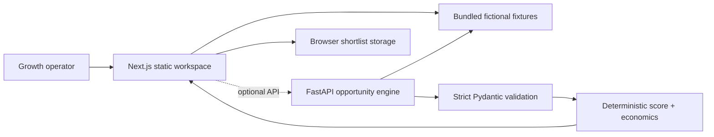

# Architecture

GitHub Pages hosts only the static frontend. The Python service is runnable/tested source and is not publicly deployed. `NEXT_PUBLIC_BASE_PATH` makes the export work at the repository subpath. `NEXT_PUBLIC_API_URL` is optional; its absence activates the labeled in-browser demo model.

## Contracts and shadow paths

`POST /opportunities/analyze` accepts a known course ID, Spanish/Portuguese/French, bounded integer price/sales/share/cost fields. It returns a score, verdict, revenue conservation and nullable payback. Nil/wrong/extra inputs return 422; unknown courses return `404 course_not_found`; existing translations return `409 language_already_served`; zero sales returns null payback and `Validate`. Frontend network failure preserves inputs and shows a retryable alert.

## Production boundary

Add authentication, tenant isolation, Postgres and a signed evidence ledger before real customer data. Contracts belong in encrypted object storage with short-lived access, never in the public frontend. External catalog/platform integrations require explicit terms review, rate limits, provenance and deletion controls.
